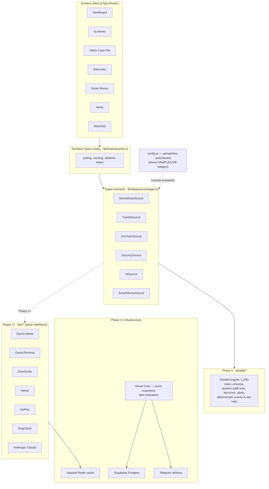

# ALPHA TERMINAL

A retail crypto intelligence terminal that aggregates on-chain, market, and
trend signals into **explainable scores** — built to help a trader spot early
opportunities and avoid scams. DexScreener's data density, a smart-money lens,
a Bloomberg-grade interface, and an AI layer that explains its reasoning.

**Core principles**

1. **Every score is explainable.** Any number expands into its exact inputs,
   weights, and reasoning. The Conviction Ring is literally the sum of the
   breakdown rows under it. No black boxes.
2. **Never fake data silently.** Every panel carries a `SAMPLE` badge until its
   real source is connected, at which point the badge flips to `LIVE`
   automatically. The user always knows which is which.
3. **No price predictions.** Scenario analysis and relative rankings grounded
   in observable data — never probabilities of future returns.

> **Status: Phase 0 complete.** The entire terminal UI is navigable and runs on
> a seeded sample-data layer with simulated latency and live-feeling updates.
> No API keys are required to run it.

## Screens

| Route | Screen |
|---|---|
| `/` | Master Dashboard — market pulse, trending narratives, conviction opportunities, new-launch feed, movers heatmap, scrolling alerts ticker; panels drag-reorder (dnd-kit) and persist to localStorage |
| `/screener` | Token Screener — virtualized 1,200-row table, filter bar (mcap buckets, liquidity, age, volume, risk tier, chain), saved presets incl. built-in **Early Discovery** |
| `/token/[id]` | Token Case File — candlestick chart (lightweight-charts), score breakdown, forensics, holders, scenario analysis, AI research brief |
| `/discovery` | Ranked opportunity cards from preset screens, each showing *why* it ranks |
| `/smart-money` | Tracked-wallet table + entries/exits feed — honestly marked `SAMPLE — requires premium data` |
| `/alerts` | Alert rule builder, rule list with toggles, notification history |
| `/watchlist` | Saved tokens, reusing the screener table |
| `/settings` | API key slots for every future integration + datasource mode readout |
| `/styleguide` | Design tokens, type scale, Conviction Ring at all sizes, badges, table styles |

Press <kbd>⌘K</kbd> / <kbd>Ctrl K</kbd> anywhere for the command palette: jump
to tokens/screens, toggle watchlist, copy addresses, generate briefs.

## Setup

```bash
npm install
npm run dev        # http://localhost:3000 — no env vars needed in Phase 0
```

Production build & lint:

```bash
npm run build
npm run lint
```

Phase 1+ environment variables are documented in [`.env.example`](.env.example)
with a comment per key on where to obtain it.

## Architecture

The UI-first approach works because **components never talk to APIs** — they
talk to typed service interfaces. Phase 0 implements those interfaces with a
seeded sample engine; later phases drop in live implementations behind the
same contracts. A single config map (`src/lib/datasources/config.ts`) controls
sample/live per source and drives every `SAMPLE`/`LIVE` badge automatically.



### Key paths

```
src/
  app/                      # one folder per screen
  components/
    terminal/               # ConvictionRing, badges, Panel, TickerNumber, …
    dashboard/ screener/ token/ shell/
    ui/                     # primitives (button, input, dialog, switch, …)
  lib/
    datasources/
      types.ts              # the service contracts (the architecture)
      config.ts             # sample/live switchboard
      index.ts              # resolver — only import point for sources
      sample/               # Phase 0 implementations + seeded engine
    hooks/queries.ts        # TanStack Query wrappers
    store/                  # localStorage stores (watchlist, layout, presets, rules, keys)
```

### Design system

Defined in `src/app/globals.css` and demonstrated at
[`/styleguide`](http://localhost:3000/styleguide): near-black field `#07080C`,
panel `#0E1117` with `#1C2230` edges, electric-cyan `#5CE1E6` reserved for
signal, red `#FF4D5E` reserved for risk. Space Grotesk for display, JetBrains
Mono with `tabular-nums` for every number. Glassmorphism on overlays only —
never on data tables. Motion is restrained and respects
`prefers-reduced-motion`.

## Roadmap

- **Phase 1 — live market data (Solana first):** DexScreener → GeckoTerminal →
  CoinGecko → Helius → GoPlus/RugCheck behind the existing interfaces, with
  Upstash caching, zod boundary validation, retry/backoff, and honest
  "source degraded" panel states. Supabase schema for tokens, score snapshots,
  watchlists, alert rules, users.
- **Phase 2 — scoring + AI:** deterministic, unit-tested `lib/scoring/`
  (weights documented in `SCORING.md`), 30-min score snapshots via Vercel Cron,
  Claude-generated research briefs and scenario analysis that cite only
  provided data.
- **Phase 3 — alerts + discovery live:** cron-evaluated rules, Telegram
  delivery, rug early-warning on watchlists by default.
- **Phase 4 — expansion:** Base + Ethereum, read-only portfolio tracking,
  Smart Money goes live only when a labeled-wallet source is contracted.

---

*Analytical tooling, not financial advice.*
