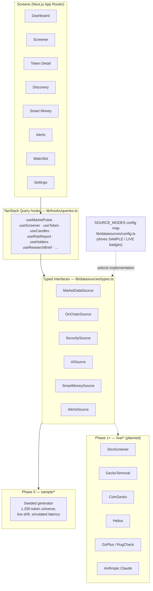

# ALPHA TERMINAL

A retail crypto intelligence terminal that aggregates on-chain, market, and trend signals into
**explainable** scores — helping a trader spot early opportunities and avoid scams.
DexScreener's data density + a smart-money lens + a Bloomberg-grade interface, with an AI layer
that explains its reasoning.

**Core principles**

1. **Every score is explainable.** Any number expands into the exact inputs, weights, and
   reasoning behind it — the Conviction Ring, score breakdowns, and forensics flags all cite
   their inputs. No black boxes.
2. **Never fake data silently.** Every panel carries a SAMPLE DATA badge in Phase 0. When a
   panel's source goes live, the badge becomes LIVE — driven automatically by one config map.
3. **No price predictions.** Scenario analysis and relative rankings grounded in observable
   data, never probabilities of future returns.

## Current status: Phase 0 — the interface

The entire terminal UI is built and navigable, powered by a realistic deterministic sample-data
layer with simulated latency and live-feeling updates. No API keys are required to run it.

| Screen | Route | Highlights |
|---|---|---|
| Master Dashboard | `/` | Market pulse strip, trending narratives, conviction opportunities, new-launches feed, movers treemap, scrolling alerts ticker; panels drag-reorder (dnd-kit) and persist to localStorage |
| Token Screener | `/screener` | Virtualized 1000+ row table, filter bar, saved presets incl. built-in "Early Discovery" |
| Token Detail | `/token/[id]` | Case file: candlestick chart (lightweight-charts), score breakdown, forensics, holders, bull/base/bear scenarios, AI research brief with stubbed Regenerate |
| Discovery | `/discovery` | Ranked opportunity cards showing the score components driving each rank |
| Smart Money | `/smart-money` | Tracked-wallet table + activity feed, honestly marked "SAMPLE — requires premium data" |
| Alerts Center | `/alerts` | Rule builder, toggleable rule list, notification history |
| Watchlist | `/watchlist` | Screener table reused for starred tokens |
| Command Palette | `⌘K` anywhere | Jump to tokens/screens, watchlist + brief actions |
| Settings | `/settings` | API key slot per future integration with connected status |
| Styleguide | `/styleguide` | Palette, type scale, Conviction Ring at all sizes, badges, table styles |

## Setup

```bash
npm install
npm run dev        # http://localhost:3000
```

No environment variables are needed for Phase 0. See `.env.example` for the keys later phases
will use, with a note per key on where to obtain it.

Other commands:

```bash
npm run build      # production build
npm run lint       # eslint
npx tsc --noEmit   # typecheck (TypeScript strict)
```

## Architecture

The UI-first approach works because **all data flows through typed service interfaces** in
`lib/datasources/types.ts` (`MarketDataSource`, `OnChainSource`, `SecuritySource`, `AISource`,
`SmartMoneySource`, `AlertsSource`). Phase 0 implements each in `lib/datasources/sample/*`;
later phases drop `live/*` implementations behind the same interfaces — components never change.
The `SOURCE_MODES` map in `lib/datasources/config.ts` controls sample/live per source and drives
every SAMPLE/LIVE badge automatically.



### Key directories

```
app/                    # one route per screen
components/
  conviction/           # ConvictionRing, ScoreBreakdown, global breakdown modal
  dashboard/            # pulse strip, narratives, opportunities, launches, heatmap, ticker, dnd grid
  token/                # token table, chart, forensics/holders/scenarios/brief panels
  shell/                # app shell, command palette
  ui/                   # panel, badges, skeletons, ticking numbers
lib/
  datasources/          # types.ts (interfaces) · config.ts (sample/live map) · sample/* · index.ts (factory)
  hooks/                # TanStack Query hooks, localStorage state, watchlist
  format.ts             # every number formats through here (tabular-nums everywhere)
```

### Design system

- Palette: `--bg #07080C`, `--panel #0E1117`, `--ink #E8ECF4`, `--muted #6B7488`,
  `--signal #5CE1E6`, `--danger #FF4D5E`, `--warn #FFB020`, `--profit #3DDC97`.
  Color is signal, never decoration.
- Type: Space Grotesk for display/UI, JetBrains Mono with `tabular-nums` for every number.
  11px uppercase letterspaced eyebrows label every data block.
- Signature element: the **Conviction Ring** — a segmented circular gauge (one segment per score
  component, arc = weight, intensity = sub-score) rendered from 16px table rows to 120px detail
  headers. Hover highlights a component; click opens the full breakdown.
- Glassmorphism on overlays/modals/palette only — never on data tables.
- Motion: cyan/red number ticks, 150ms panel fade-slides, feed rows slide in from the top.
  All animation respects `prefers-reduced-motion`.

## Roadmap

- **Phase 1 — Live market data (Solana first):** DexScreener, GeckoTerminal, CoinGecko, Helius,
  GoPlus, RugCheck behind the same interfaces, with Upstash Redis caching, zod validation, retry
  with backoff, and honest "source degraded" states. Supabase for persistence.
- **Phase 2 — Scoring + AI:** deterministic, unit-tested momentum/risk scoring in `lib/scoring/`
  (documented in `SCORING.md`), 30-min score snapshots via Vercel Cron, Claude-generated research
  briefs and scenarios that cite only provided data.
- **Phase 3 — Alerts + discovery live:** cron-evaluated rules, Telegram delivery, rug
  early-warning on watchlisted tokens by default.
- **Phase 4 — Expansion:** Base + Ethereum, read-only portfolio tracking, Smart Money goes live
  only when a real labeled-wallet source is contracted.

---

*Analytical tooling, not financial advice.*
