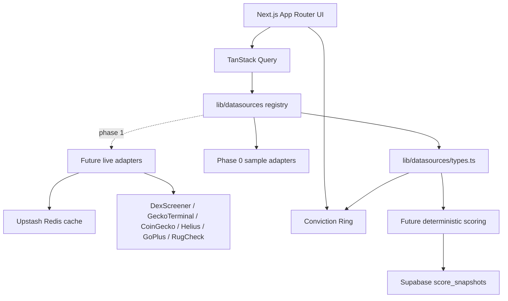

# ALPHA Terminal

A UI-first retail crypto intelligence terminal. Phase 0 ships the navigable interface on explicit sample data,
with typed datasource contracts ready for panel-by-panel live integrations.

## Current Phase 0 deliverables

- `/styleguide` design-system route with exact palette tokens, type scale, Conviction Ring sizes, badges, and table styles.
- Typed datasource boundary in `lib/datasources/types.ts`.
- Sample datasource implementations in `lib/datasources/sample/*` with simulated latency and live-feeling value drift.
- Master Dashboard at `/` with draggable/reorderable panels persisted to `localStorage`.

Every sample-backed panel displays a `SAMPLE DATA` badge. Future live adapters should switch the source mode to `live`
through `lib/datasources/config.ts`, which drives `LIVE` badges without component rewrites.

## Setup

```bash
npm install
npm run dev
```

Open:

- `http://localhost:3000/styleguide`
- `http://localhost:3000/`

## Checks

```bash
npm run lint
npm run typecheck
npm run build
```

## Architecture



## Environment

Copy `.env.example` to `.env.local` for future live integrations. Phase 0 sample mode runs without secrets.
