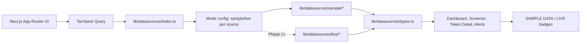

# Alpha Terminal

A UI-first retail crypto intelligence terminal for explainable on-chain, market, and trend signals.

Phase 0 is intentionally powered by clearly labeled sample data. Every panel carries a `SAMPLE DATA`
badge until its datasource is replaced by a live implementation behind the same typed interface.

## Stack

- Next.js App Router
- TypeScript strict
- Tailwind CSS design tokens
- TanStack Query
- dnd-kit
- lightweight-charts (reserved for token detail charts)
- Supabase, Upstash Redis, Anthropic SDK dependencies ready for later phases

## Setup

```bash
npm install
cp .env.example .env.local
npm run dev
```

Open:

- `http://localhost:3000/styleguide` for the Phase 0 design system review route
- `http://localhost:3000/` for the Master Dashboard

## Validation

```bash
npm run lint
npm run typecheck
npm run build
```

## Architecture



## Scoring stance

The UI presents explainable scores and scenario conditions only. It does not produce price predictions,
future-return probabilities, or unstated data provenance.
