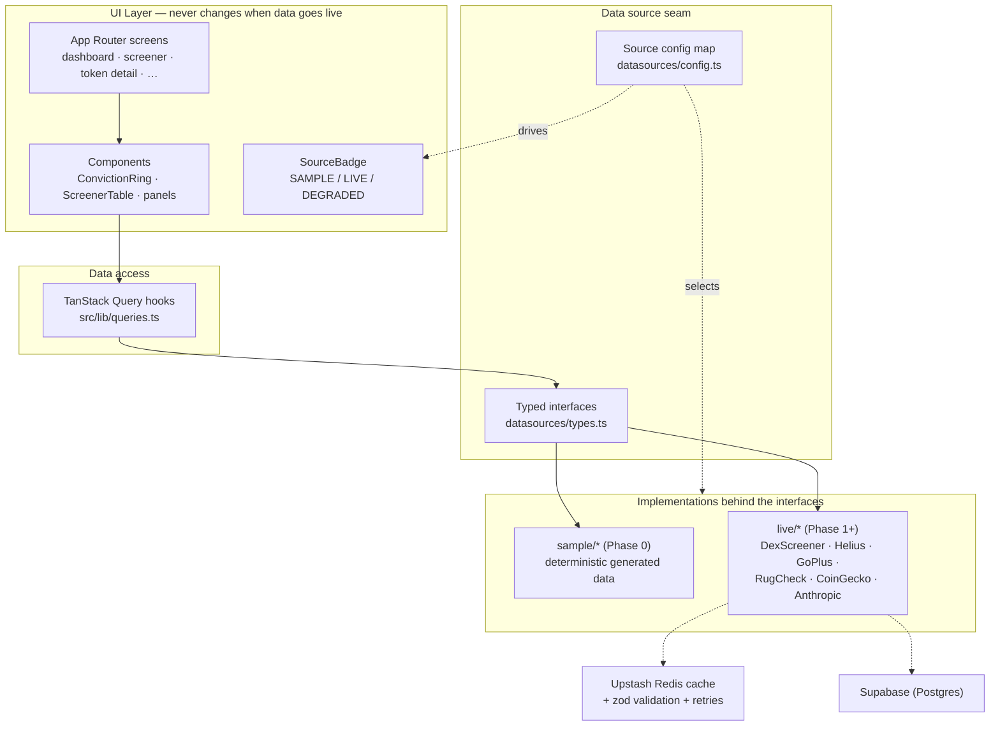

# Alpha Terminal

A retail crypto **intelligence terminal** that aggregates on-chain, market, and trend signals into **explainable scores** — helping a trader spot early opportunities and avoid scams. Think DexScreener's data density + Nansen's smart-money lens + a Bloomberg-grade interface, with an AI layer that explains its reasoning.

> **Phase 0 (this build):** the entire interface, fully navigable, powered by a realistic **sample-data** layer. Every panel carries a `SAMPLE` badge. Later phases swap sample sources for live APIs **panel by panel** — without redesigning anything, because the UI is architected for that swap from day one.

## Core principles

1. **Every score is explainable.** Any number expands into the exact inputs, weights, and reasoning behind it. Click any Conviction Ring → full breakdown. No black boxes.
2. **Never fake data silently.** Every panel shows `SAMPLE` / `LIVE` / `DEGRADED` status, read from a single config map. There is no way to render data without declaring its source.
3. **No price predictions.** Output is scenario analysis and relative rankings grounded in observable data — never probabilities of future returns.

## Screens

| Route | Screen | Notes |
|---|---|---|
| `/` | Master Dashboard | Market Pulse strip, Trending Narratives, AI Conviction Opportunities, New Launches feed, Movers heatmap. Panels are **draggable** (dnd-kit), layout persisted to `localStorage`. |
| `/screener` | Token Screener | **Virtualized** 1,000+ row table, filter bar, saved presets incl. built-in **Early Discovery**. |
| `/token/[id]` | Token Detail (Case File) | Candlestick chart (lightweight-charts), score breakdown, forensics, holders, scenarios, AI research brief. |
| `/discovery` | Discovery | Ranked opportunity cards showing the *why* behind each rank. |
| `/smart-money` | Smart Money | Tracked-wallet table — honestly marked **SAMPLE — requires premium data**. |
| `/alerts` | Alerts Center | Rule builder, rule toggles, notification history. |
| `/watchlist` | Watchlist | Reuses the screener table for saved tokens. |
| `/settings` | Settings | API key slots for every future integration with connected/disconnected status. |
| `/styleguide` | Style Guide | Palette, type scale, Conviction Ring at all scales, badges, table styles. |
| `⌘K` | Command Palette | Jump to any token/screen, run actions. |

## Tech stack

Next.js 14 (App Router) · TypeScript (strict) · Tailwind CSS · shadcn-style UI (Radix) · TanStack Query · lightweight-charts · dnd-kit · cmdk · Vitest. Designed for Supabase · Upstash Redis · Anthropic · Vercel + Vercel Cron in later phases.

## Getting started

```bash
npm install
npm run dev          # http://localhost:3000
```

No API keys are required for Phase 0 — everything runs on the sample-data layer.

```bash
npm run build        # production build
npm run lint         # eslint
npm run typecheck    # tsc --noEmit (strict)
npm test             # vitest
```

To prepare for live data, copy the env template and fill keys as each source goes live:

```bash
cp .env.example .env.local
```

## Architecture — the swap-friendly seam

All data flows through **typed service interfaces** in [`src/lib/datasources/types.ts`](src/lib/datasources/types.ts) (`MarketDataSource`, `OnChainSource`, `SecuritySource`, `AISource`, `SmartMoneySource`). Phase 0 implements each as `sample/*` returning realistic generated data with simulated latency and live-feeling refetches. Later phases drop in `live/*` implementations behind the **same** interfaces — components never change. A single config map ([`config.ts`](src/lib/datasources/config.ts)) controls sample/live per source and drives the `SAMPLE` / `LIVE` badges automatically.

State & fetching use **TanStack Query** everywhere, even against sample sources, so swapping to live APIs changes nothing in the components.



## Roadmap

- **Phase 0 — Interface (done):** every screen navigable on labeled sample data.
- **Phase 1 — Live market data (Solana first):** screener → token detail → new launches → forensics → holders → trends. Each live call goes through `lib/datasources/live/<source>.ts` with caching, rate-limit awareness, retries, and zod validation; a failing source degrades its panel honestly.
- **Phase 2 — Scoring + AI:** deterministic, unit-tested momentum & risk scoring (`lib/scoring/*`, documented in `SCORING.md`); score-history snapshots via cron; live AI research agent (Claude) + scenario generation.
- **Phase 3 — Alerts + discovery live:** cron-evaluated rules, Telegram + in-app delivery, rug early-warning default on watchlisted tokens.
- **Phase 4 — Expansion:** Base + Ethereum via the same pipeline; read-only portfolio tracking; Smart Money goes live only when a labeled-wallet source is contracted.

## Engineering rules

1. zod-validate every external response at the boundary (Phase 1+).
2. Scoring is pure, deterministic, unit-tested, documented.
3. Secrets in env vars; see [`.env.example`](.env.example).
4. Each phase merges only when builds, lints, types, and tests pass.
