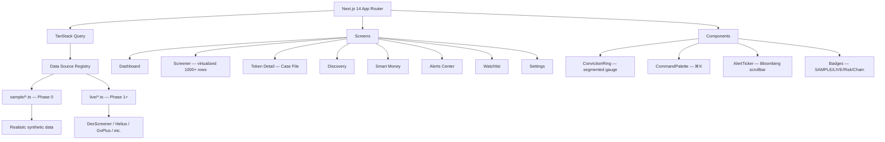

# AlphaTerminal — Crypto Intelligence Terminal

A retail crypto intelligence terminal aggregating on-chain, market, and trend signals into explainable scores. Think DexScreener's data density + Nansen's smart-money lens + a Bloomberg-grade interface, with an AI layer that explains its reasoning.

## Architecture



## Quick Start

```bash
npm install
cp .env.example .env.local
npm run dev
```

Open [http://localhost:3000](http://localhost:3000) → redirects to `/dashboard`.

Visit `/styleguide` for the complete design system reference.

## Phase Map

| Phase | What goes live | Key APIs |
|-------|---------------|----------|
| **0** | Full UI on sample data (current) | none |
| **1** | Live market data (Solana first) | DexScreener, GeckoTerminal, CoinGecko, Helius, GoPlus, RugCheck |
| **2** | Scoring engine + AI briefs | Anthropic Claude, Vercel Cron |
| **3** | Alerts delivery + Discovery live | Telegram Bot |
| **4** | Multi-chain (Base + ETH), Portfolio | Alchemy |

## Core Principles

1. **Every score is explainable.** Any number expands into exact inputs, weights, and reasoning.
2. **Never fake data silently.** Every panel carries a `SAMPLE DATA` or `LIVE` badge.
3. **No price predictions.** Outputs are scenario analysis and relative rankings — never probabilities of future returns.

## Stack

- **Next.js 14+** App Router · TypeScript strict
- **Tailwind CSS** with custom design token system
- **TanStack Query** for all data fetching
- **@tanstack/react-virtual** for virtualized screener table (1000+ rows)
- **dnd-kit** for draggable dashboard panels
- **Space Grotesk** (UI) + **JetBrains Mono** (data) typography
- **Supabase** (Phase 1+) · **Upstash Redis** (Phase 1+)
- **Anthropic Claude** (Phase 2+)

## Data Source Architecture

All data flows through typed interfaces in `src/lib/datasources/types.ts`. Phase 0 implements each as `sample/*.ts`. Later phases drop in `live/*.ts` behind the same interface — components never change. The config map in `src/lib/datasources/index.ts` controls active implementations and drives the SAMPLE/LIVE badges automatically.

## Design System

See `/styleguide` for:
- Full colour palette with semantic usage rules
- Typography scale (Space Grotesk + JetBrains Mono)
- **Conviction Ring** at all sizes (16px → 120px+) — the product's visual identity
- All badge variants (SAMPLE/LIVE, Risk tier, Chain, Severity)
- Table styles, skeleton loaders, glassmorphism surfaces, button variants

## Key Design Tokens

```css
--bg:      #07080C  /* near-black void */
--panel:   #0E1117  /* panel surfaces */
--ink:     #E8ECF4  /* primary text */
--muted:   #6B7488  /* labels */
--signal:  #5CE1E6  /* live data, primary actions */
--danger:  #FF4D5E  /* risk — nothing else */
--warn:    #FFB020  /* caution */
--profit:  #3DDC97  /* gains */
```
